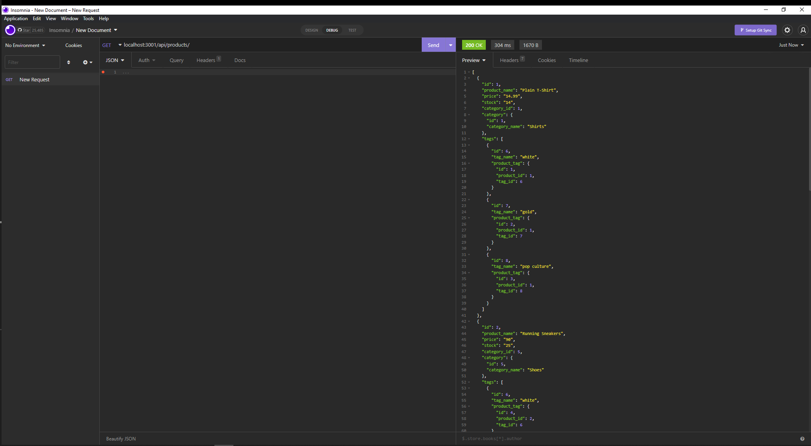

# 13 Object-Relational Mapping (ORM): E-Commerce Back End

<br />
  
   Snapshot of using Insomnia to test e-commerce backend:
    <br />


## Video Link

Link to Screencastify/Castify Video of application in action: https://app.castify.com/view/229c0a09-1376-4de5-b1fa-20dac52cdbaa


  ## Description

This is a backend **e-commerce inventory management systems** application used to manage a company's products, using Node.js, Sequelize, MySQL, and custom API calls.

  ## Challenges

A bit of thought had to go in understanding the relationships with the various models and how this played in to developing correct routes. Once this was figured for Categories it really became a "cut & paste" for the other model routes.


## User Story

```md
AS A manager at an internet retail company
I WANT a back end for my e-commerce website that uses the latest technologies
SO THAT my company can compete with other e-commerce companies
```

## Acceptance Criteria

```md
GIVEN a functional Express.js API
WHEN I add my database name, MySQL username, and MySQL password to an environment variable file
THEN I am able to connect to a database using Sequelize
WHEN I enter schema and seed commands
THEN a development database is created and is seeded with test data
WHEN I enter the command to invoke the application
THEN my server is started and the Sequelize models are synced to the MySQL database
WHEN I open API GET routes in Insomnia for categories, products, or tags
THEN the data for each of these routes is displayed in a formatted JSON
WHEN I test API POST, PUT, and DELETE routes in Insomnia
THEN I am able to successfully create, update, and delete data in my database
```

 ## Table of Contents
  - [Description](#description)
  - [Installation](#installation)
  - [Usage](#usage)
  - [License](#license)
  - [Contributors](#contributors)
  - [Tests](#tests)
  - [Questions](#questions)
  ## Installation
   The applications requires npm install to enable all of the associated packages. Next step requires the User to create the schema for the 'ecommerce_db' database and 
   then run```node .\seeds\index.js``` in order to seed the database. After this, run ```node .\server.js``` to start the server. Last step is to use Insomnia to issue 
   full CRUD commands (i.e. POST,PUT,GET, and DELETE) for 'categories', 'products', and 'tags'.
  ## Usage
   Backend system to manage inventory for an e-commerce site.
  ## License
  
  <br />
  MIT License URL:   https://opensource.org/licenses/MIT. 
  ## Contributors
   Sam De Marco
  ## Tests
  No tests exist for this project.
  ## Questions
   Email<br />
  <br />
  My GitHub: [Samdemarco](https://github.com/Samdemarco)

  Contact me via email for any issues: sam.demarco@gmail.com<br /><br />

